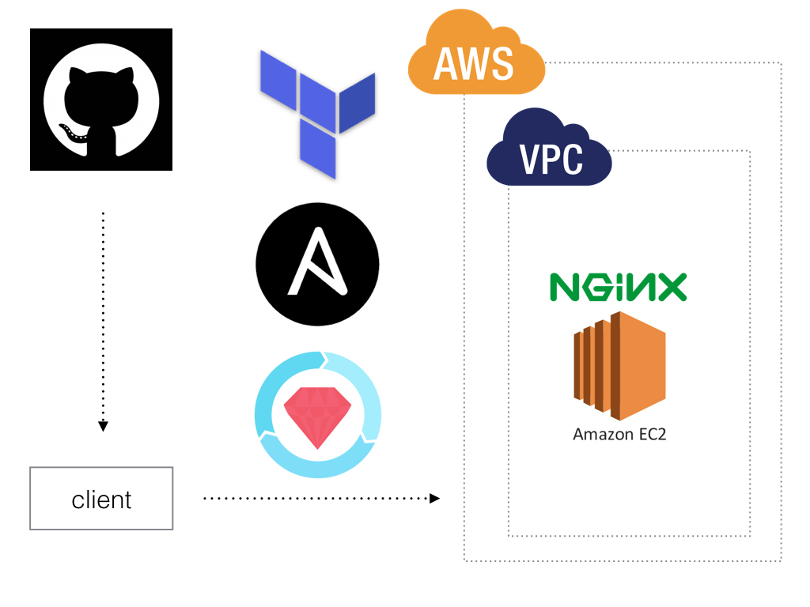

# Nginx Up and Running
Learn about Nginx, AWS, and CI/CD.



## Includes
- AWS
  - EC2
- Nginx
- Terraform
- Ansible
- Infrataster

## Prepare

### Dependency

I confirm to work folloing software version.

```
$ terraform --version
Terraform v0.11.7
+ provider.aws v1.26.0

$ ansible --version
ansible 2.3.2.0

$ ruby --version
ruby 2.5.0p0 (2017-12-25 revision 61468) [x86_64-darwin15]
```

### Configuration

- create `.terraform.tfvars`
- exec `terraform init`
- exec `bundle install`

## Usage

You can deploy and test nginx on AWS using following command.

- exec `sh script/create.sh`

And you can login nginx-server.

```
$ ssh ec2-user@<ip addr>
```
